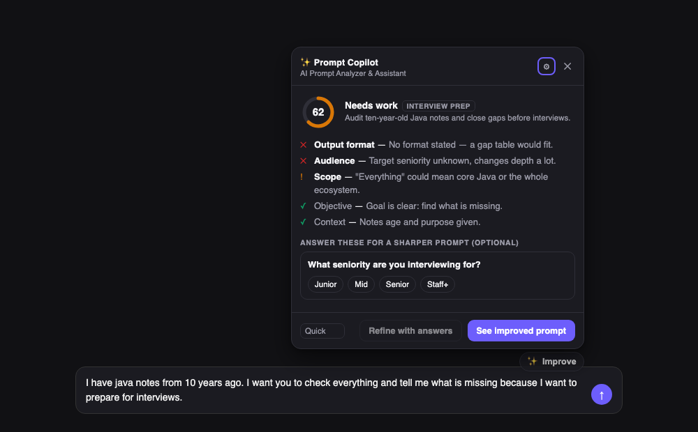
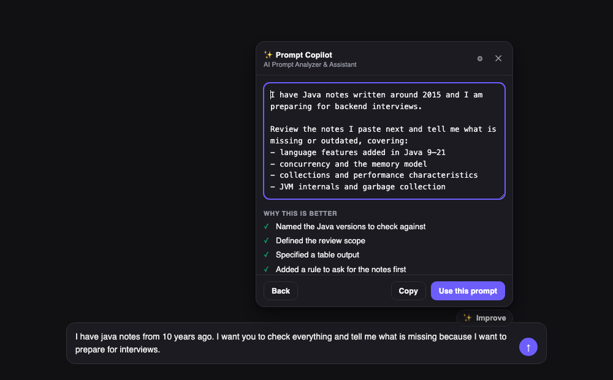

# ✨ Prompt Copilot

**AI Prompt Analyzer & Assistant** — a Chrome extension that sits next to the prompt box on
ChatGPT, Claude, Gemini, Perplexity, Microsoft Copilot and Grok. Click ✨ Improve and it scores your
prompt, tells you what is actually missing, and hands back a better version you can edit before it
goes anywhere near the input box.

It is not a "make it longer" button. A short prompt can score 100.

<p align="center">
  
  
</p>
<p align="center"><sub>Left: what's weak and why. Right: the rewrite, editable before it goes anywhere.<br>
Rendered from <code>tools/testbed/</code> with a fixed sample analysis — the UI is real, the numbers are illustrative.</sub></p>

---

## What it does

```
your prompt → local pre-flight → one model call → health score → improved prompt → you approve → input box
```

1. **Detects the prompt box** on the page (generic + per-site hints, survives DOM churn).
2. **Pre-flight, locally**: empty/oversized checks, plus a scan for API keys, tokens and card
   numbers. If it finds any, it warns you *before* anything leaves the browser.
3. **Analyzes** in one request: task classification, per-dimension verdicts, clarifying questions,
   and an improved prompt.
4. **Scores** in local deterministic code, weighted by which dimensions actually matter for your task.
5. **You decide**: edit, copy, apply, or cancel. Nothing is ever written into the page automatically.

## Prompt health

Fifteen dimensions (objective, context, specificity, constraints, output format, audience, role,
scope, examples, technical detail, success criteria, ambiguity, completeness, consistency,
conciseness). For every prompt the model marks each one `critical` / `useful` / `not_applicable`,
then `ok` / `weak` / `missing`.

The score is arithmetic over that, computed on your machine:

| relevance | weight | | status | credit |
|---|---|---|---|---|
| critical | 3 | | ok | 1.0 |
| useful | 1 | | weak | 0.5 |
| not_applicable | 0 | | missing | 0 |

`score = round(100 × Σ(weight × credit) / Σ(weight))`

**85+ excellent · 70–84 strong · 50–69 needs work · <50 weak**

Because irrelevant dimensions carry zero weight, *"What is a Java HashMap?"* scores 100 — it has no
audience, no output format and no success criteria, and never needed them. Quality is measured
against your intent, not against a checklist.

## Improvement modes

`Quick` (default, tightens and clarifies — usually shorter) · `Deep` · `Technical` · `Research` ·
`Interview`. Switch per-analysis from the panel footer, or set a default in settings.

## Install

```bash
npm install && npm run build
```

Then in Chrome: `chrome://extensions` → enable **Developer mode** → **Load unpacked** → select the
`dist/` folder. The options page opens on first install.

Add an API key for one provider (Anthropic, OpenAI, Google, or any OpenAI-compatible endpoint
including Ollama and LM Studio). It is **your** key calling **your** provider — there is no
Prompt Copilot server.

## Use

Type a prompt on a supported site, then click **✨ Improve** above the box, or press
<kbd>Alt</kbd>+<kbd>Shift</kbd>+<kbd>P</kbd>.

## Supported platforms

ChatGPT · Claude · Gemini · Perplexity · Microsoft Copilot · Grok

Detection is generic first and site-specific second, so it usually keeps working when these sites
change their markup. To add a site: one entry in `HOST_HINTS`
([src/content/adapters.ts](src/content/adapters.ts)) and one `matches` line in
[public/manifest.json](public/manifest.json).

## Privacy in one paragraph

Prompts leave your browser only when you click ✨ Improve, and only to the provider you configured.
There is no backend, no analytics, no telemetry. History is off by default and local-only. Your API
key lives in `chrome.storage.local`, is never synced, and is readable only by the service worker —
never by a content script or the page you are on. Full detail: [PRIVACY.md](PRIVACY.md).

## Permissions, and why each one

| Permission | Why |
|---|---|
| `storage` | Settings, and your API key. |
| `host_permissions` on three API hosts | The service worker calling OpenAI / Anthropic / Google. |
| `optional_host_permissions` | Requested only if you configure a custom endpoint. |
| `content_scripts` on six AI sites | Finding the prompt box. Not `<all_urls>`. |

No `tabs`, no `scripting`, no `webRequest`, no `<all_urls>`.

## Docs

[ARCHITECTURE.md](ARCHITECTURE.md) · [DEVELOPMENT.md](DEVELOPMENT.md) · [PRIVACY.md](PRIVACY.md) ·
[ROADMAP.md](ROADMAP.md)
